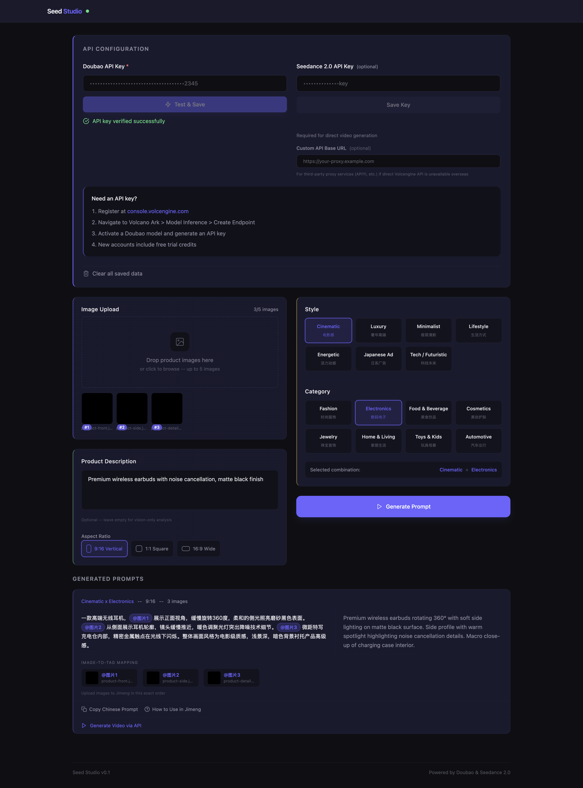
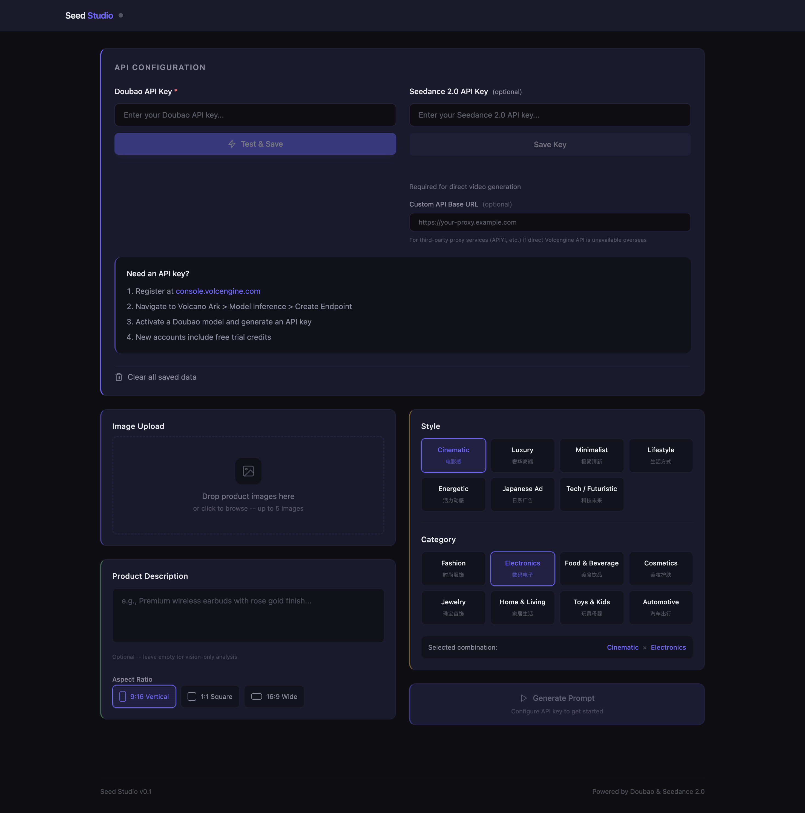
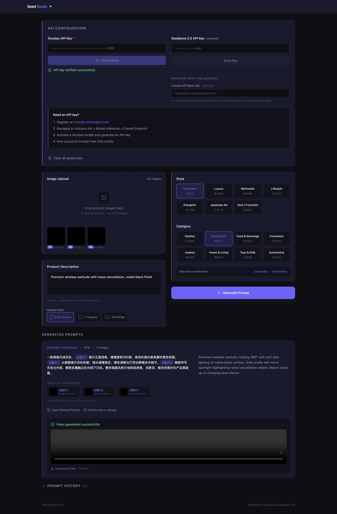

# Seed Studio

**Turn product photos into AI video prompts in under 2 minutes.**

Seed Studio is a single HTML file that generates Chinese-language [Seedance 2.0](https://seed.bytedance.com/en/seedance2_0) video prompts from your product photos. Upload images, pick a style, get a prompt. No Chinese language skills needed, no prompt engineering knowledge required.



## Why this exists

Seedance 2.0 works with English prompts, but the results are noticeably better in Chinese. This isn't just a hunch. Users who have tested both consistently [report](https://x.com/physicalvini/status/2023530802512826744) more accurate outputs with Chinese. Others [note](https://x.com/lovvrEth/status/2031169531432022142) that the model "responds better to Chinese prompts" overall. One [analysis](https://x.com/Preda2005/status/2031053216771875317) argues this comes down to semantic density: Chinese characters pack more meaning per token, so the model gets more instruction in fewer words. Some users even found that a [hybrid approach](https://x.com/billtheinvestor/status/2022524447945785660) works best: English for technical camera control, Chinese for atmosphere and emotion.

The [Jimeng platform](https://jimeng.jianying.com) (ByteDance's consumer video tool) itself says it has "better semantic understanding" with Chinese input. The [official prompt guide](https://www.volcengine.com/docs/82379/1587797) and the community prompt libraries on [GitHub](https://github.com/YouMind-OpenLab/awesome-seedance-2-prompts) are all Chinese-first. The vocabulary conventions for camera movement, lighting, and pacing that Seedance responds to best are documented in Chinese.

If you're an international content creator, that's a wall. You can see the demo videos, but you can't write the prompts that produced them.

Seed Studio removes that wall. You upload product photos and describe your product in English. The app sends your images to ByteDance's [Doubao](https://www.volcengine.com/product/doubao) vision model, which analyzes the product and writes a structured Chinese prompt using Seedance-native vocabulary for your chosen style. You get the Chinese prompt to copy into [Jimeng](https://jimeng.jianying.com), plus an English translation so you can see what it says.

## Features

- 56 preset combinations: 7 visual styles (Cinematic, Luxury, Minimalist, Lifestyle, Energetic, Japanese Ad, Tech/Futuristic) crossed with 8 product categories (Fashion, Electronics, Food, Cosmetics, Jewelry, Home, Toys, Automotive)
- Doubao vision model analyzes your actual product photos and references specific visual details in the prompt
- Chinese prompt output with English translation side by side
- Two paths to video: copy the prompt into [Jimeng](https://jimeng.jianying.com) manually, or submit directly to the [Seedance 2.0 API](https://www.volcengine.com/docs/82379/1520757) from within the app
- Prompt history saved to localStorage, so you can reload or copy past generations
- Configurable proxy URL for users outside China who need to route API calls through a third-party service
- Single HTML file. Download it, open it in a browser, done.

## Quick start

1. Download [`seed-studio.html`](seed-studio.html) (or clone this repo)
2. Open the file in Chrome, Edge, Safari, or Firefox
3. Get a Doubao API key from [Volcengine](https://console.volcengine.com) (details below)
4. Enter your key in the API Configuration section, click "Test & Save"
5. Upload 1-5 product photos, pick a style and category, click Generate Prompt

Your Chinese Seedance 2.0 prompt is ready to copy.

## Getting a Volcengine API key

You need a Doubao API key (required for prompt generation). A Seedance 2.0 API key is optional, only needed if you want direct video generation from within the app.

1. Register at [console.volcengine.com](https://console.volcengine.com)
2. Navigate to [Volcano Ark](https://www.volcengine.com/product/ark) > Model Inference > Create Endpoint
3. Activate the Doubao model and [generate an API key](https://www.volcengine.com/docs/82379/1541594)
4. New accounts come with free trial credits

For the Seedance 2.0 API key (optional): same console, activate the Seedance 2.0 model. Check the [model list](https://www.volcengine.com/docs/82379/1330310) for available model IDs. Note that direct API access from outside China may need a proxy; see below.

## Usage

### Copy-paste to Jimeng (recommended)

This is the main workflow. After generating a prompt:

1. Click "Copy Chinese Prompt" to copy it to your clipboard
2. Click "How to Use in Jimeng" for the step-by-step visual guide
3. Open [Jimeng](https://jimeng.jianying.com) and select AI Video > Seedance 2.0
4. Choose "All-Round Reference" (全能参考) mode, upload your images in the order shown
5. Paste the prompt and generate

The app shows which uploaded images map to which `@ImageN` tags in the prompt, so you upload them in the right order on Jimeng's side.

### Direct API video generation

If you have a Seedance 2.0 API key:

1. Enter your key in the API Configuration section
2. After generating a prompt, click "Generate Video via API"
3. The app polls for progress and shows elapsed time
4. Watch the video in-browser when it's done, or download it

The app uses the [video generation task API](https://www.volcengine.com/docs/82379/1520757) to submit jobs and the [query task API](https://www.volcengine.com/docs/82379/1521309) to poll for completion.

### Overseas users and proxy setup

ByteDance suspended overseas Seedance 2.0 API access in March 2026. If you're outside China, you have two options:

- Use the Jimeng copy-paste workflow. This works from anywhere.
- Configure a proxy URL. Enter a third-party proxy URL (like [APIYI](https://www.apiyi.com)) in the "Custom API Base URL" field. The proxy is used for both Doubao prompt generation and Seedance video generation calls.

## Screenshots

<table>
<tr>
<td align="center">Fresh interface</td>
<td align="center">Prompt generated</td>
<td align="center">Video complete</td>
</tr>
<tr>
<td></td>
<td></td>
<td></td>
</tr>
</table>

## How it works

The whole app is one HTML file. No build step, no node_modules. Open it in a browser and it runs.

Stack:
- [Tailwind CSS v4](https://tailwindcss.com) (Play CDN) for styling
- [Alpine.js 3.x](https://alpinejs.dev) for reactive state management with `$persist` for localStorage
- Vanilla `fetch()` for API calls to [Volcengine Ark](https://www.volcengine.com/product/ark)

```
Product Photos + Description + Style Preset
        ↓
   Doubao Vision API (analyzes images, writes Chinese prompt)
        ↓
   Chinese Seedance 2.0 Prompt + English Translation
        ↓
   Copy to Jimeng  ──or──  Submit to Seedance 2.0 API
        ↓                          ↓
   Manual video generation    Automatic video generation
```

The app manages 5 Alpine stores: `config` (API keys), `presets` (style/category selection), `generation` (images, prompts, results), `video` (Seedance API state), and `history` (saved prompts).

## Official references

- [Seedance 2.0 overview](https://seed.bytedance.com/en/seedance2_0) (ByteDance)
- [Volcengine Ark platform](https://www.volcengine.com/product/ark) (API access)
- [Seedance prompt guide](https://www.volcengine.com/docs/82379/1587797) (official, in Chinese)
- [Video generation API reference](https://www.volcengine.com/docs/82379/1520757) (create tasks)
- [Query video task API](https://www.volcengine.com/docs/82379/1521309) (poll for results)
- [Video generation overview](https://www.volcengine.com/docs/82379/1366799) (capabilities and tutorials)
- [Model list and pricing](https://www.volcengine.com/docs/82379/1330310)
- [API key setup guide](https://www.volcengine.com/docs/82379/1541594)
- [Jimeng (即梦)](https://jimeng.jianying.com) (consumer platform for Seedance 2.0)

## Roadmap

Some ideas for future versions:

- [ ] Generate 2-3 prompt variations per request
- [ ] Adjustable parameters (camera speed, lighting intensity)
- [ ] Edit the Chinese prompt directly before copying
- [ ] Batch generation for multiple products
- [ ] Preset import/export via JSON

## Contributing

Contributions welcome. The whole app is one HTML file, so the workflow is simple:

1. Fork this repo
2. Create a feature branch (`git checkout -b feature/your-feature`)
3. Edit `seed-studio.html`
4. Test by opening the file in a browser
5. Commit and open a pull request

Keep changes scoped to one feature. Single-file diffs are easy to review when they're focused.

## License

[MIT](LICENSE)

## Acknowledgments

- [Volcengine](https://www.volcengine.com) for the Doubao and Seedance 2.0 APIs
- The Seedance prompt community, especially [awesome-seedance-2-prompts](https://github.com/YouMind-OpenLab/awesome-seedance-2-prompts) and [awesome-Seedance-2.0-prompt](https://github.com/MapleShaw/awesome-Seedance-2.0-prompt), whose research on Chinese prompt vocabulary informed the preset system
